# YunTechCSIE-MadOnline
這個APP是我在系學會擔任高中營隊總召時寫的，可以讓學員們登入帳號，登入會會有每組的隊伍資訊，裡面設有聊天室能夠和其他學員聊天促進感情，當然瘋資谷的技能是不能少的，可以賺錢發動機能攻擊別隊，每隊都有一隻代表的角色，每個技能都有相對應的動畫。 
## 功能
+ 帳號登入
+ 隊伍資訊紀錄和顯示
+ 聊天室
+ 角色攻擊動畫
+ 工人介面能夠派發技能和藥水給各小隊
+ 血條動畫  

## 實際畫面
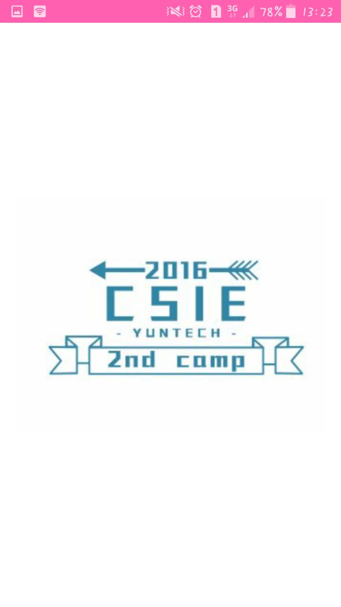
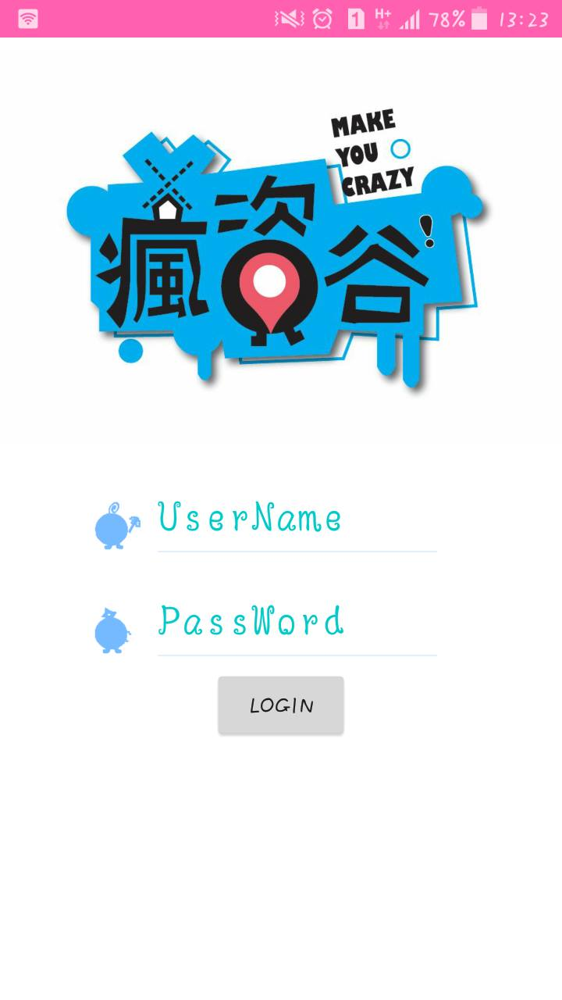
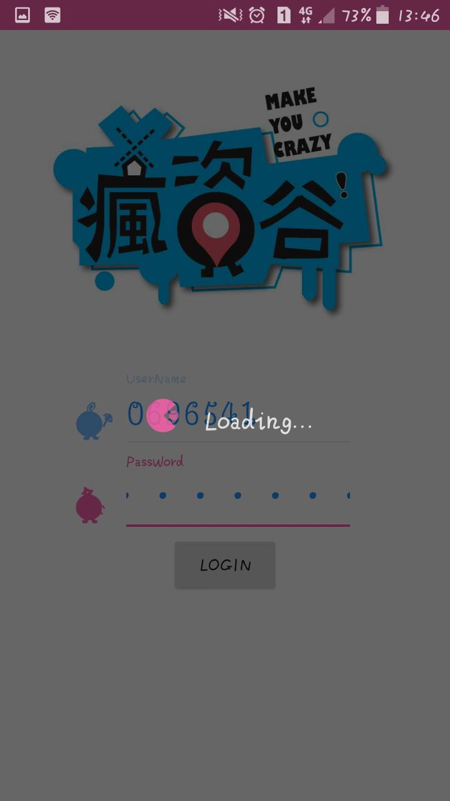
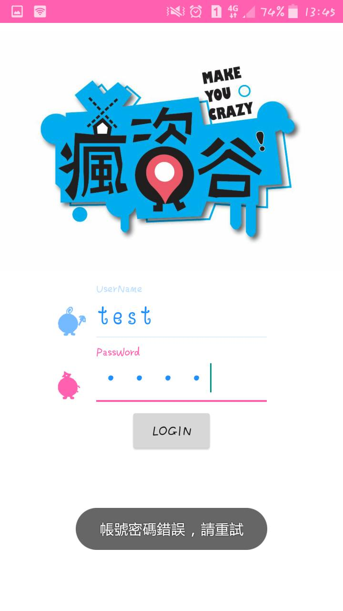
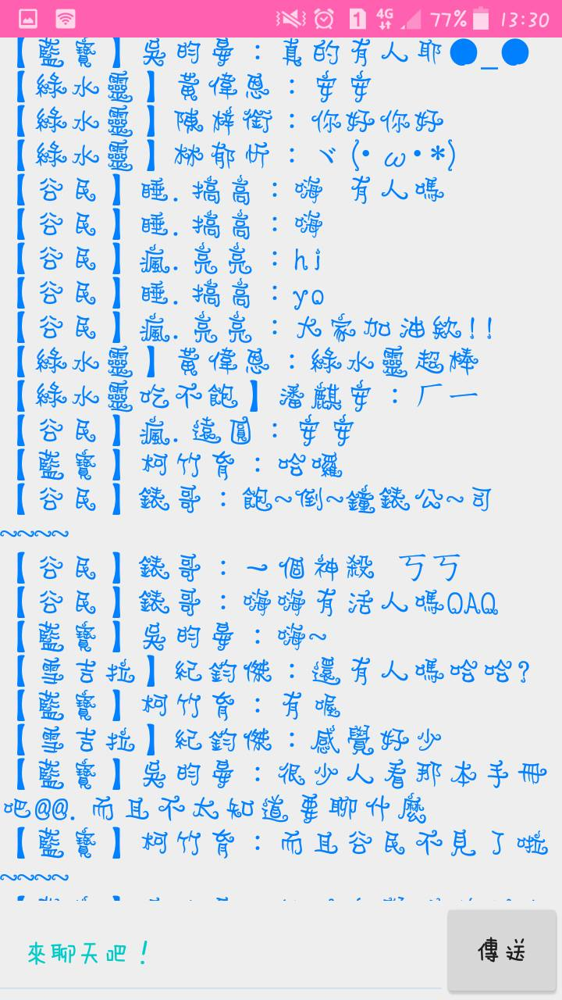
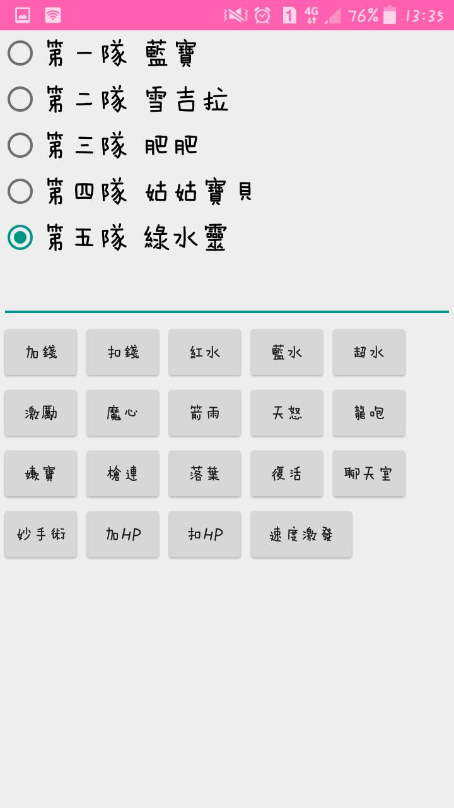
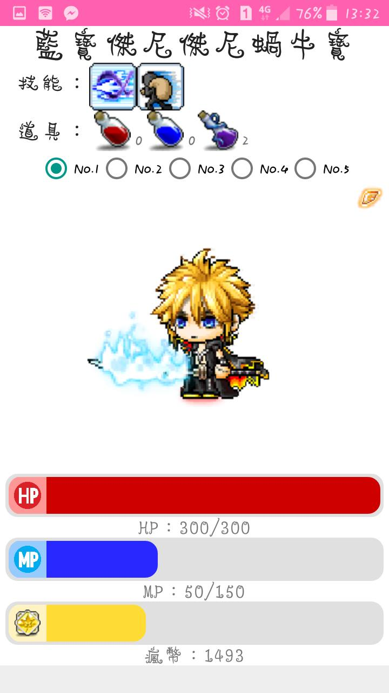
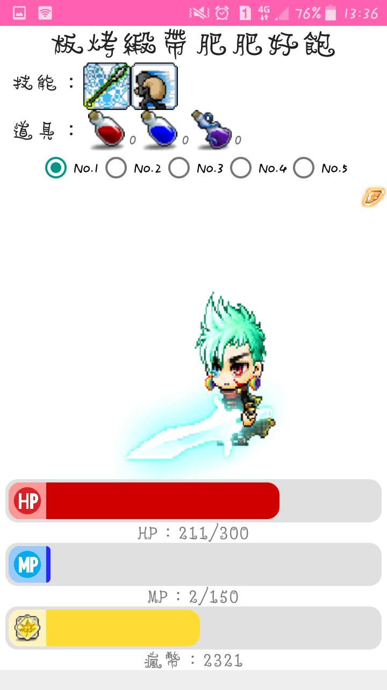
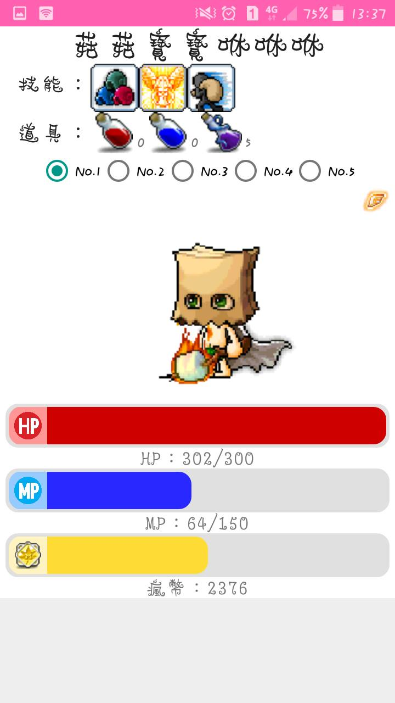
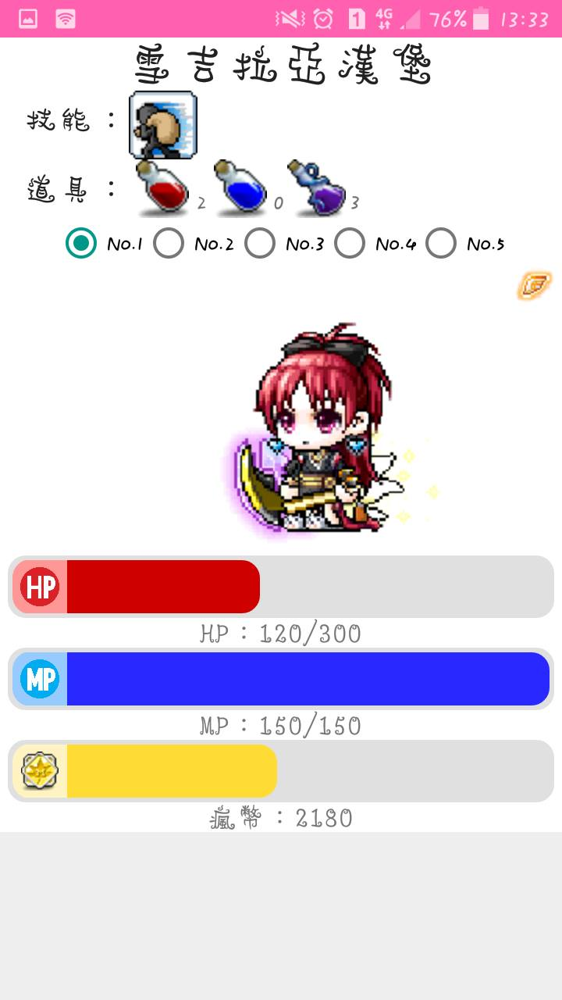
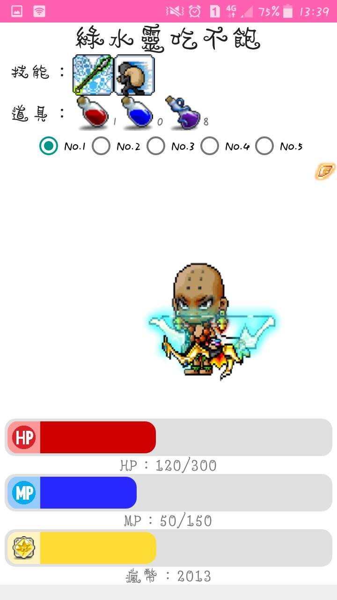
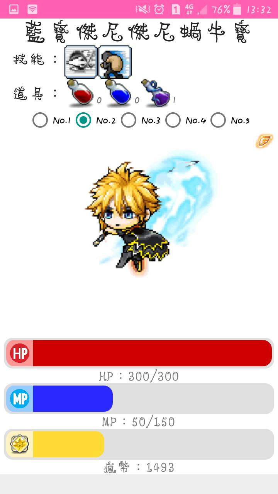
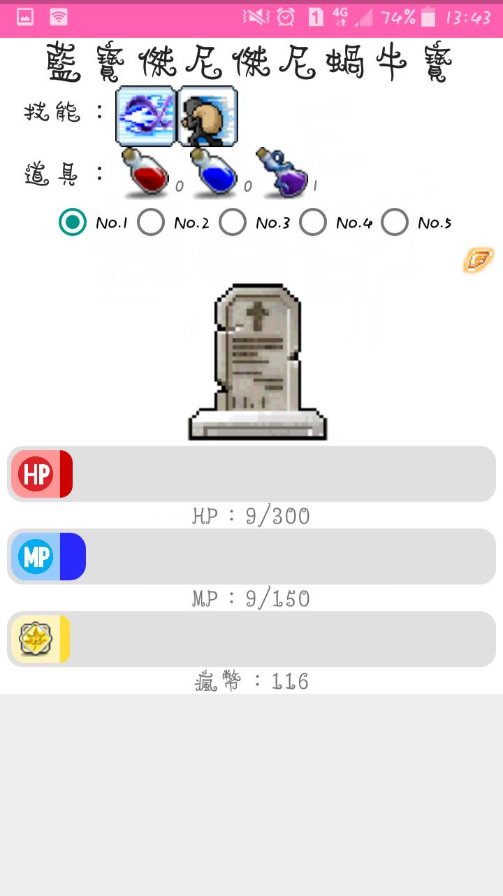
